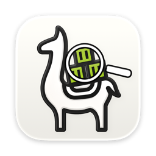

# ColimaStatus

<p align="center">
  
</p>

ColimaStatus is a lightweight, open-source macOS menu bar companion for your
local [Colima](https://github.com/abiosoft/colima) installation. It keeps the
state of Colima visible at a glance and lets you start or stop it without
opening a terminal.

The application is written in Go and uses the standalone
[`fyne.io/systray`](https://fyne.io/systray) module. It runs as a macOS agent
application without a Dock icon or a separate window.

## Features

- Shows whether the selected Colima profile is running, stopped, missing, or
  broken.
- Displays the profile's runtime, architecture, CPU count, and memory.
- Starts and stops Colima directly from the menu bar.
- Uses Colima's `--force` option when stopping a broken profile.
- Uses the Colima llama as a monochrome macOS template icon: bright while
  Colima is running and dimmed otherwise.
- Reacts to Lima lifecycle events when `limactl watch --json` is available.
- Keeps an energy-conscious 15-minute safety check, which also serves as the
  fallback when event watching is unavailable, plus a manual refresh action.
- Supports native launch at login through Apple's Service Management API on
  macOS 13 and later.
- Finds Homebrew and MacPorts installations even when macOS starts the app
  with a restricted `PATH`.
- Supports custom Colima profiles and executable locations.
- Follows the macOS language in English and German.

All status checks and actions run locally. ColimaStatus does not require a
cloud account or a background service of its own.

## Requirements

- macOS 11 or later
- [Colima](https://github.com/abiosoft/colima)
- Go 1.25 or later and Xcode Command Line Tools when building from source

Install Colima with Homebrew if it is not already available:

```sh
brew install colima
```

## Build and install

Clone the repository and build the application bundle:

```sh
git clone https://github.com/KevinCFechtel/ColimaStatus.git
cd ColimaStatus
./Build/build.sh
open dist/ColimaStatus.app
```

The build script creates an ad-hoc signed `dist/ColimaStatus.app`. Move the app
to `/Applications` for regular use and before enabling launch at login.

The bundle identifier is `dev.kevincfechtel.ColimaStatus`.

## Usage

Open the llama icon in the macOS menu bar to view the current profile status
and configuration. The menu provides actions to start, stop, or immediately
refresh Colima.

On macOS 13 or later, enable the launch-at-login checkbox to register
ColimaStatus as a native login item. If macOS requires approval, the app offers
a direct link to the Login Items panel in System Settings. The option is
unavailable on macOS 11 and 12.

The default Colima profile is monitored unless configured otherwise:

| Environment variable | Purpose |
| --- | --- |
| `COLIMASTATUS_PROFILE` | Monitor a profile other than `default` |
| `COLIMASTATUS_COLIMA_PATH` | Use a Colima executable in a non-standard location |
| `COLIMASTATUS_LANGUAGE` | Override the app language with `en` or `de` |

These variables must be present in the environment that launches the app.
ColimaStatus automatically resolves the required `colima` and `limactl`
directories for normal GUI and login-item launches.

## Development

The repository includes scripts for the common development tasks:

```sh
./Build/run.sh       # Build and run the menu bar app
./Build/format.sh    # Format Go source files
./Build/localization.sh # Validate localization catalogs
./Build/test.sh      # Run the test suite with the race detector
./Build/vet.sh       # Run Go's static analysis
```

Regenerate the adaptive app icon and its legacy fallback with:

```sh
./Build/generate-icons.sh
```

The modern application icon is maintained as a layered Icon Composer asset in
`assets/AppIcon.icon`. It follows the macOS light, dark, and tinted
appearances; the dark background uses Apple's native `system-dark` material.
`Build/Assets.car` contains the adaptive icon, while `Build/AppIcon.icns`
remains the fallback for older supported macOS versions. Regeneration requires
Xcode 26 or later.

## Localization

English is ColimaStatus's source and fallback language. German is maintained in
the embedded JSON catalogs under `internal/localization/locales`. The app uses
the operating system language unless `COLIMASTATUS_LANGUAGE` is set to `en` or
`de`.

User-facing messages are defined as typed methods in `internal/localization`.
After changing a message, extract the English catalog, merge the German
translation, and validate both catalogs:

```sh
go tool goi18n extract -sourceLanguage en -format json \
  -outdir internal/localization/locales internal/localization
go tool goi18n merge -sourceLanguage en -format json \
  -outdir internal/localization/locales \
  internal/localization/locales/active.en.json \
  internal/localization/locales/active.de.json
./Build/localization.sh
```

## Versioning

The release version is stored in `VERSION` using `MAJOR.MINOR.PATCH`.
`BUILD_NUMBER` contains the positive, monotonically increasing build number.
`Build/build.sh` writes both values into the generated bundle and embeds them,
together with the Git commit, in the binary.

Inspect and validate the metadata with:

```sh
./Build/version.sh
./Build/build.sh
dist/ColimaStatus.app/Contents/MacOS/ColimaStatus --version
```

For a new release, update both files. A `v*` tag on the release commit must
match `v$(cat VERSION)`; rebuilding the same version requires incrementing only
`BUILD_NUMBER`.

Contributions and bug reports are welcome. Please run the formatter, tests,
and static analysis before submitting a pull request.

## Creating a release

A signed and notarized release requires an Apple Developer ID Application
certificate and a `notarytool` profile stored in the Keychain:

```sh
xcrun notarytool store-credentials macos-notary
cp Build/.env.example Build/.env
# Set SIGNING_IDENTITY in Build/.env.
./Build/release.sh
```

`Build/.env` is ignored by Git. The release script builds the app with the
hardened runtime, signs and notarizes it, staples the notarization ticket,
checks it with Gatekeeper, and writes the distributable archive to
`dist/release/`.

## License

ColimaStatus is available under the [BSD 3-Clause License](LICENSE).
Attributions for third-party assets and dependencies are documented in
[THIRD_PARTY_NOTICES.md](THIRD_PARTY_NOTICES.md).

ColimaStatus is an independent community project and is not affiliated with
or endorsed by the Colima project.
