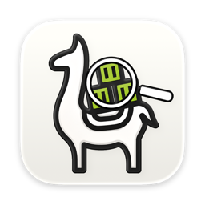

# ColimaStatus

<p align="center">
  
</p>

ColimaStatus is a lightweight, open-source macOS menu bar companion for your
local [Colima](https://github.com/abiosoft/colima) installation. It keeps the
state of Colima visible at a glance and lets you start or stop it without
opening a terminal.

The application is written in Go and uses the standalone
[`fyne.io/systray`](https://fyne.io/systray) module. It runs as a macOS agent
application without a Dock icon or a separate window.

## Features

- Shows whether the selected Colima profile is running, stopped, missing, or
  broken.
- Displays the profile's runtime, architecture, CPU count, and memory.
- Starts and stops Colima directly from the menu bar.
- Uses Colima's `--force` option when stopping a broken profile.
- Uses the Colima llama as a monochrome macOS template icon: bright while
  Colima is running and dimmed otherwise.
- Reacts to Lima lifecycle events when `limactl watch --json` is available.
- Keeps an energy-conscious 15-minute safety check, which also serves as the
  fallback when event watching is unavailable, plus a manual refresh action.
- Supports native launch at login through Apple's Service Management API.
- Finds Homebrew and MacPorts installations even when macOS starts the app
  with a restricted `PATH`.
- Supports custom Colima profiles and executable locations through a settings
  file, because environment variables do not reach a menu bar app.
- Writes a log the menu can reveal, so a failed start is diagnosable.
- Follows the macOS language in English and German.

All status checks and actions run locally. ColimaStatus does not require a
cloud account or a background service of its own.

## Requirements

- macOS 13 or later
- [Colima](https://github.com/abiosoft/colima)
- Go 1.25 or later and Xcode Command Line Tools when building from source

Install Colima with Homebrew if it is not already available:

```sh
brew install colima
```

## Build and install

Clone the repository and build the application bundle:

```sh
git clone https://github.com/KevinCFechtel/ColimaStatus.git
cd ColimaStatus
./Build/build.sh
open dist/ColimaStatus.app
```

The build script creates an ad-hoc signed `dist/ColimaStatus.app` as a
universal binary for Apple Silicon and Intel. Set `COLIMASTATUS_ARCHS=arm64`
for a faster single-architecture development build. Move the app to
`/Applications` for regular use and before enabling launch at login.

The bundle identifier is `dev.kevincfechtel.ColimaStatus`.

## Usage

Open the llama icon in the macOS menu bar to view the current profile status
and configuration. The menu provides actions to start, stop, or immediately
refresh Colima.

Enable the launch-at-login checkbox to register ColimaStatus as a native login
item. If macOS requires approval, the app offers a direct link to the Login
Items panel in System Settings.

## Settings

Settings live in a JSON file that is created with the defaults on first start:

```
~/Library/Application Support/ColimaStatus/config.json
```

The menu offers **Show settings in Finder** to reveal it. Changes take effect on
the next start.

| Key | Purpose | Default |
| --- | --- | --- |
| `profile` | The Colima profile to monitor | `default` |
| `colimaPath` | A Colima executable in a non-standard location | autodetected |
| `language` | Force `en` or `de` instead of following macOS | follow macOS |
| `checkIntervalMinutes` | Safety-net interval, clamped to 1 minute … 24 hours | `15` |

A missing, unreadable, or future-version file is not an error: ColimaStatus
falls back to the defaults and records the reason in the log.

The file exists because environment variables do not reach a menu bar app —
macOS starts it from Finder or as a login item, neither of which inherits a
shell environment. `COLIMASTATUS_PROFILE`, `COLIMASTATUS_COLIMA_PATH`, and
`COLIMASTATUS_LANGUAGE` still override the file when they are set, which is the
quickest way to try a different profile from a terminal.

ColimaStatus automatically resolves the required `colima` and `limactl`
directories for normal GUI and login-item launches, including Homebrew,
MacPorts, Nix, and `~/.local/bin`.

## Diagnostics

The log records which Colima executable was found, the profile in use, and why
a fallback happened:

```
~/Library/Logs/ColimaStatus/colimastatus.log
```

The menu offers **Show log in Finder** to reveal it. It is rotated at 1 MiB and
one previous generation is kept. The tooltip on the last-check row says whether
live Lima events are arriving or whether only the periodic check is available.

## Development

The repository includes scripts for the common development tasks:

```sh
./Build/run.sh       # Build and run the menu bar app
./Build/format.sh    # Format Go source files
./Build/localization.sh # Validate localization catalogs
./Build/test.sh      # Run the test suite with the race detector
./Build/vet.sh       # Run Go's static analysis
```

Regenerate the adaptive app icon with:

```sh
./Build/generate-icons.sh
```

The modern application icon is maintained as a layered Icon Composer asset in
`assets/AppIcon.icon`. It follows the macOS light, dark, and tinted
appearances; the dark background uses Apple's native `system-dark` material.
`Build/Assets.car` contains the compiled adaptive icon and is the only icon
resource in the bundle; the app bundle references it through `CFBundleIconName`.
`assets/AppIconPreview.png` is rendered from the same catalog so the image above
always matches what macOS shows. Regeneration requires Xcode 26 or later.

## Localization

English is ColimaStatus's source and fallback language. German is maintained in
the embedded JSON catalogs under `internal/localization/locales`. The app uses
the operating system language unless `COLIMASTATUS_LANGUAGE` is set to `en` or
`de`.

User-facing messages are defined as typed methods in `internal/localization`.
After changing a message, extract the English catalog, merge the German
translation, and validate both catalogs:

```sh
go tool goi18n extract -sourceLanguage en -format json \
  -outdir internal/localization/locales internal/localization
go tool goi18n merge -sourceLanguage en -format json \
  -outdir internal/localization/locales \
  internal/localization/locales/active.en.json \
  internal/localization/locales/active.de.json
./Build/localization.sh
```

## Versioning

The release version is stored in `VERSION` using `MAJOR.MINOR.PATCH`.
`BUILD_NUMBER` contains the positive, monotonically increasing build number.
`Build/build.sh` writes both values into the generated bundle and embeds them,
together with the Git commit, in the binary.

`Build/version.sh` also owns `APP_DEPLOYMENT_TARGET`, the single source of the
minimum macOS version. It drives the compiler flags, the icon catalog, and
`LSMinimumSystemVersion`, and `Build/build.sh` fails if the linked binary
reports a different minimum version than the bundle declares.

Inspect and validate the metadata with:

```sh
./Build/version.sh
./Build/build.sh
dist/ColimaStatus.app/Contents/MacOS/ColimaStatus --version
```

For a new release, update both files. A `v*` tag on the release commit must
match `v$(cat VERSION)`; rebuilding the same version requires incrementing only
`BUILD_NUMBER`.

Contributions and bug reports are welcome. Please run the formatter, tests,
and static analysis before submitting a pull request.

Every push and pull request runs the same checks on a macOS runner through
`.github/workflows/ci.yml`: formatting, `go vet`, the localization catalogs,
the race-enabled test suite, `golangci-lint`, `govulncheck`, and a full bundle
build that verifies the plist, the signature, and the minimum macOS version.
Tagging a `v*` commit additionally runs `.github/workflows/release.yml`, which
checks the tag against `VERSION` and publishes an ad-hoc signed bundle for
inspection. Signing and notarization stay local in `Build/release.sh`.

## Creating a release

A signed and notarized release requires an Apple Developer ID Application
certificate and a `notarytool` profile stored in the Keychain:

```sh
xcrun notarytool store-credentials macos-notary
cp Build/.env.example Build/.env
# Set SIGNING_IDENTITY in Build/.env.
./Build/release.sh
```

`Build/.env` is ignored by Git. The release script builds the universal app
with the hardened runtime, signs and notarizes it, staples the notarization
ticket, checks it with Gatekeeper, verifies that both architecture slices are
present, and writes `ColimaStatus-<version>-macos-universal.zip` to
`dist/release/`.

## Homebrew cask

ColimaStatus is distributed through the tap at
[`kevincfechtel/homebrew-tap`](https://github.com/KevinCFechtel/homebrew-tap):

```sh
brew install --cask kevincfechtel/tap/colimastatus
```

The cask is generated, never hand-written, so its version and checksum cannot
drift from the published artifact. Editing `Casks/colimastatus.rb` in the tap
has no lasting effect — the next release overwrites it. Corrections belong in
`Build/cask.sh`.

The order matters, because `brew audit --online` downloads the asset and
compares it against `sha256`:

```sh
./Build/release.sh                    # build, sign, notarize, archive
# publish the release and upload the archive, then:
./Build/cask.sh --verify-published "$(brew --repository kevincfechtel/tap)/Casks/colimastatus.rb"
brew style --cask kevincfechtel/tap
brew audit --cask --online --strict --tap=kevincfechtel/tap
# then commit and push the tap
```

`depends_on macos:` is derived from `APP_DEPLOYMENT_TARGET`, so moving the
deployment target moves the cask with it.

## License

ColimaStatus is available under the [BSD 3-Clause License](LICENSE).
Attributions for third-party assets and dependencies are documented in
[THIRD_PARTY_NOTICES.md](THIRD_PARTY_NOTICES.md).

ColimaStatus is an independent community project and is not affiliated with
or endorsed by the Colima project.
